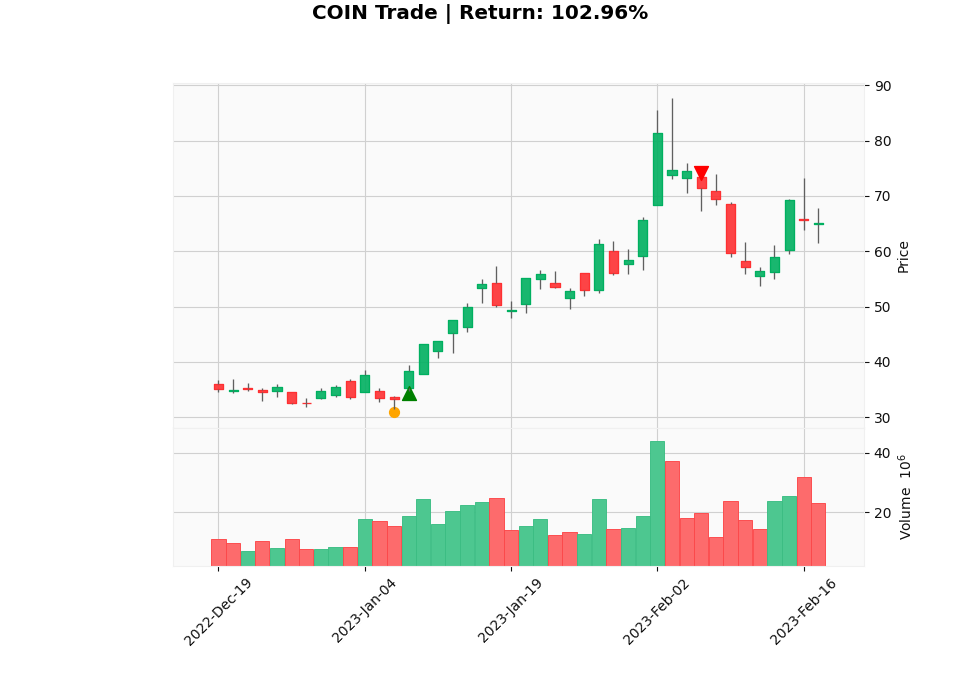
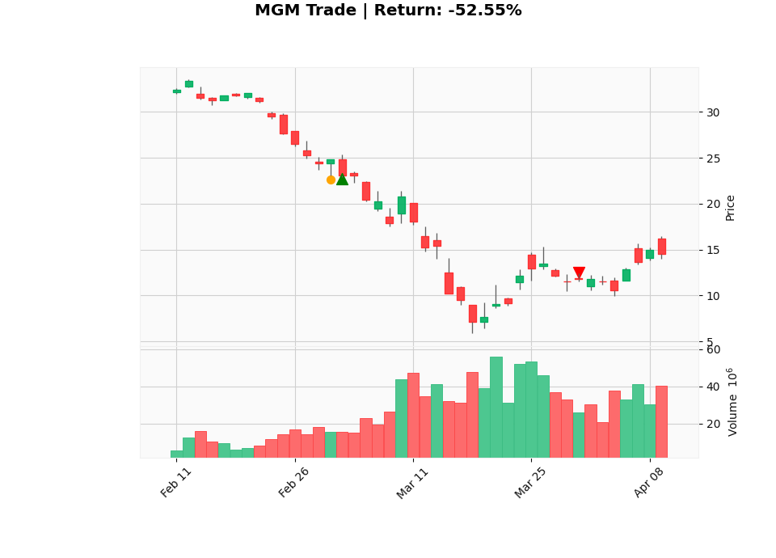

# Bottom Pattern Handbook

This handbook provides a guide to understanding and using the "Stop Falling" bottom pattern identified in our research.

## What is a "Stop Falling" Pattern?

A "Stop Falling" pattern is a technical signal suggesting that a stock's downtrend may be exhausting and a reversal is imminent. Identifying these patterns allows traders to enter positions with a favorable risk-to-reward ratio.

## Our Identified Pattern: The Hammer at a 3-Month Low

Through extensive backtesting on S&P 500 stocks over a 10-year period, we have identified a high-quality setup: **The Hammer Candlestick at a 3-Month Low.**

### The Logic
1.  **3-Month Low**: The stock price hits a level lower than it has been in the last 63 trading days (approx. 3 months). This indicates a significant downtrend or pullback.
2.  **Hammer Candlestick**: On the day of the low (or immediately following), a "Hammer" candle forms.
    *   **Long Lower Shadow**: Indicates sellers pushed the price down, but buyers stepped in to push it back up.
    *   **Small Body**: Indicates the open and close prices are close together, often near the high of the day.
    *   **Psychology**: This represents a rejection of lower prices.

### Performance Stats
*   **Win Rate**: ~58%
*   **Average Return (20-day hold)**: ~2.25%

## Visual Examples

### Winning Trade

*Above: A clear Hammer candle forms at the bottom of a downtrend. The price reverses and trends higher.*

### Losing Trade

*Above: A Hammer forms, but the downward momentum is too strong, and the price continues to fall.*

## How to Use the Tools

### 1. Research & Detection
Run the research script to find past occurrences and validate the strategy on current data:
```bash
python research_bottoms_v4.py
```
This will generate `backtest_results_4.csv` containing all detected trades.

### 2. Visualization
To see the charts for the best and worst trades found:
```bash
python visualize.py
```
This generates PNG images in the root directory.

## Tips for Traders
*   **Confirmation**: Wait for the next candle to close above the Hammer's high for added safety (though our backtest buys the next open).
*   **Risk Management**: Always set a stop loss below the low of the Hammer candle.
*   **Context**: Combine this pattern with other indicators like Support levels or RSI divergence for even better results.
